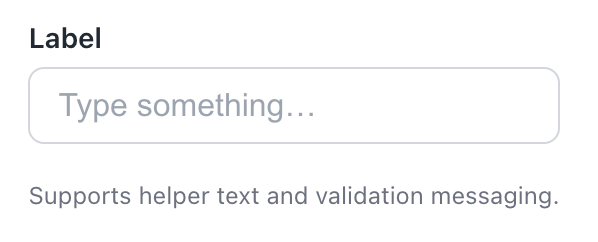
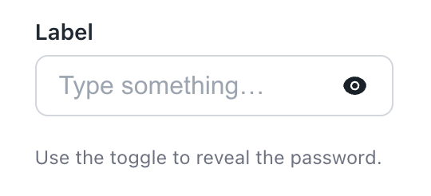
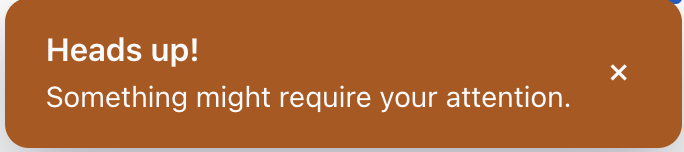
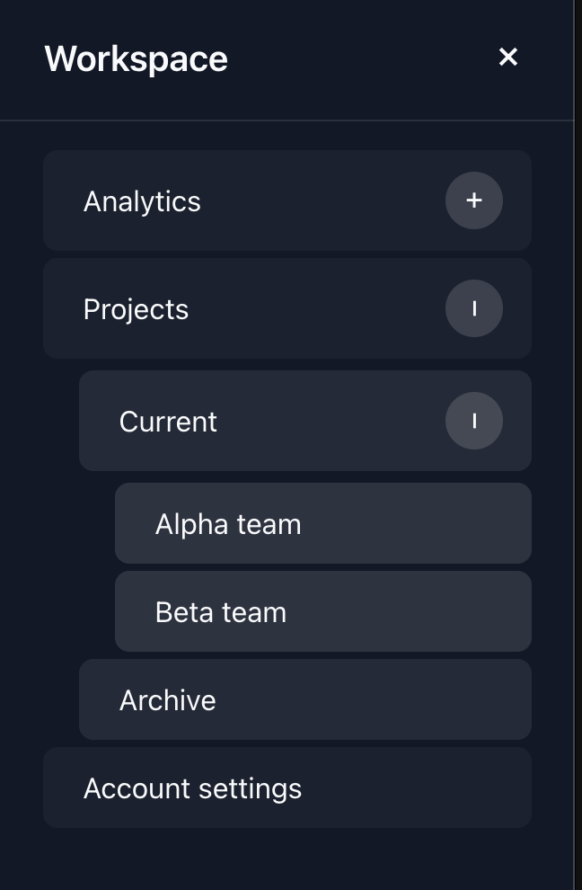
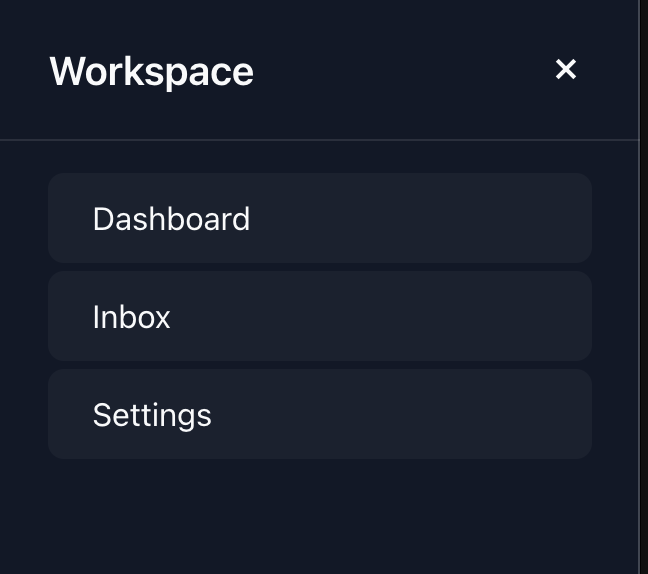
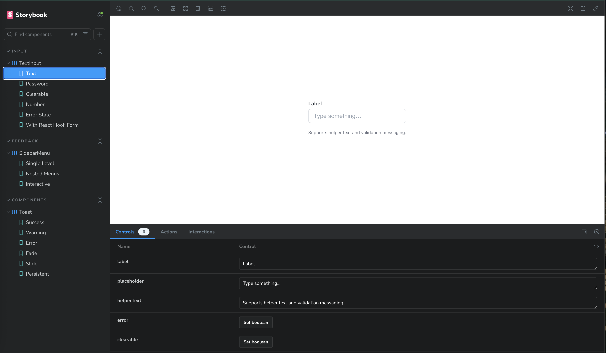
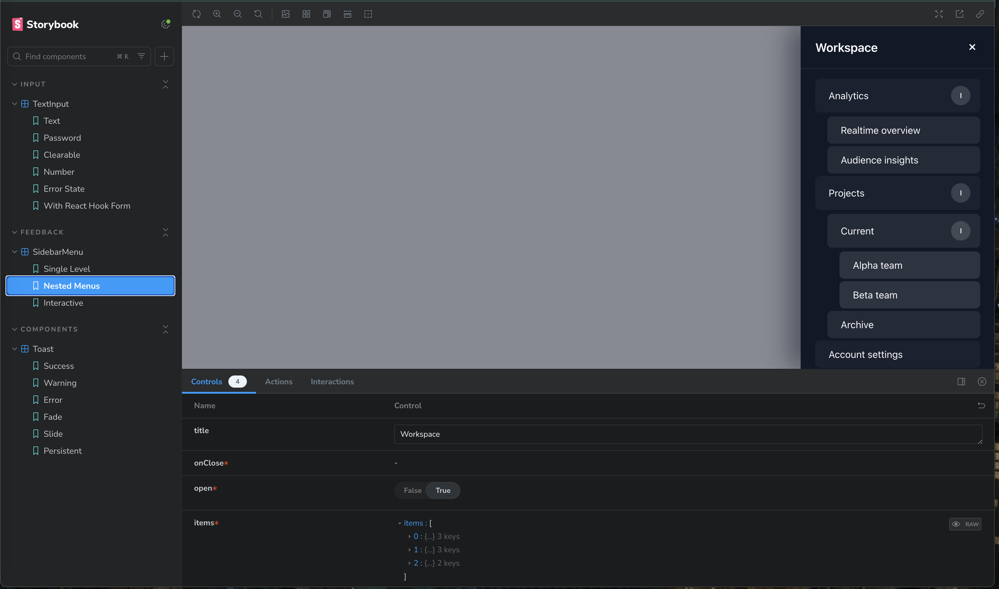
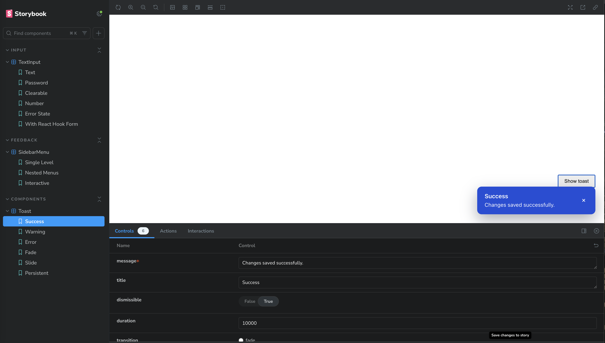

# React Component Library Assessment

This repository contains a small React + Storybook component system that implements the three components described in the assessment brief: an enhanced `Input`, a `Toast` notification, and a nested `SidebarMenu`. The project was bootstrapped with Create React App (TypeScript template) and configured with Storybook.

## Getting Started

### Prerequisites

- Node.js >= 18 (Node 20.17+ recommended)
- npm 8+

Install dependencies:

```bash
npm install
```

### Available Scripts

- `npm start` – run the CRA app on [http://localhost:3000](http://localhost:3000)
- `npm run storybook` – launch Storybook on [http://localhost:6006](http://localhost:6006)
- `npm run build` – create a production build of the CRA app
- `npm run build-storybook` – generate a static Storybook build (outputs to `storybook-static`)
- `npm test` – run the CRA test runner
- `npm run format` – run Prettier across source files

## Component Library

- **Input (`src/components/Input`)**  
  Accepts all native input props, supports multiple types, optional label/helper/error styles, a password visibility toggle, and a clear button.
   

- **Toast (`src/components/Toast`)**  
  Fixed bottom-right notification with configurable fade/slide transitions, severity variants, optional dismiss button, and auto-dismiss duration handling (values ≤ 0 fall back to the default timeout; auto-dismiss + close button).
   

- **SidebarMenu (`src/components/SidebarMenu`)**  
  Right-aligned sliding drawer with backdrop, supports unlimited nested menu items, remembers expanded state, and closes via backdrop or close button.
   

## Storybook

Each component exports TypeScript definitions, and their Storybook stories live in `src/stories` grouped by domain.




📚 Live Storybook: https://mariiasuper.github.io/develops-test-assements

The repository includes a GitHub Actions workflow (`.github/workflows/deploy-storybook.yml`) that builds Storybook and publishes it to GitHub Pages whenever `main` is updated. After pushing to `main`, turn on **GitHub Pages** in the repo settings with the source set to **GitHub Actions** to activate deployments.
